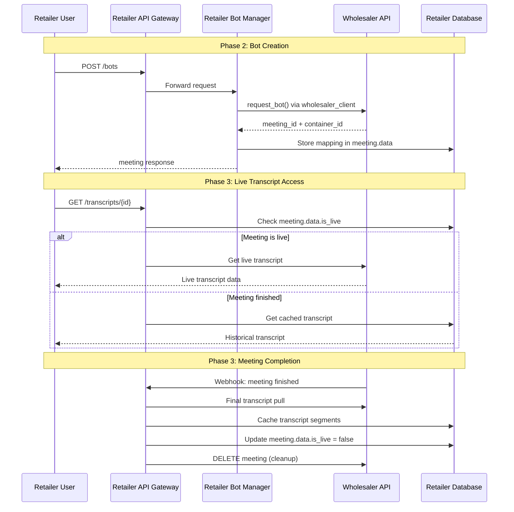

# Vexa Retailer Refactoring Plan

## Critical Assessment & Refined Approach

### **Core Principle: Preserve External Interface, Replace Internal Implementation**

Instead of changing function signatures and APIs, we'll keep the same interfaces but replace Docker operations with HTTP API calls to the Wholesaler.

### **Key Architectural Insight: Data Flow & Persistence**

**Wholesaler API (https://gateway.dev.vexa.ai/):**
- Manages live meetings and real-time transcription
- **Does NOT store meeting/transcript data long-term**
- Sends webhook when meeting finishes
- Expects cleanup (DELETE) calls after meeting ends

**Retailer Service:**
- Pulls transcripts from Wholesaler API during meeting
- Receives webhook notification when meeting ends
- Does final transcript pull and persists locally
- Calls DELETE to clean up Wholesaler resources
- Serves historical transcripts from own database

## **Phase 1: Infrastructure Cleanup & Preparation**

### **1.1 Remove Unused Services**
**Target:** `docker-compose.yml`

**Remove completely:**
```yaml
# REMOVE these services:
- whisperlive
- whisperlive-cpu  
- transcription-collector
- traefik
```

**Keep and simplify:**
```yaml
# KEEP these services (simplified):
- api-gateway
- admin-api  
- bot-manager
- postgres
- redis (basic only, no streams)
```

**New environment variables:**
```yaml
environment:
  - VEXA_INFRA_API_URL=https://gateway.dev.vexa.ai
  - VEXA_INFRA_API_KEY=${VEXA_INFRA_API_KEY}
  - SERVICE_LAYER_ID=${SERVICE_LAYER_ID:-retailer-1}
  - WHOLESALER_WEBHOOK_SECRET=${WHOLESALER_WEBHOOK_SECRET}
```

### **1.2 Database Strategy** 
- **Remove:** `libs/shared-models/alembic/` directory entirely
- **Strategy:** Fresh DB setup for development, keep existing schema
- **Keep:** All existing table/column names unchanged
- **Add:** Minimal new fields only where absolutely necessary

### **1.3 Smoke Test Phase 1**
```bash
# Test 1: Services start successfully
docker-compose up -d
curl http://localhost:8056/  # API Gateway health

# Test 2: Database connectivity  
curl http://localhost:8057/admin/users  # Admin API

# Test 3: Live Wholesaler API connectivity
curl https://gateway.dev.vexa.ai/  # Should return {"message":"Welcome to the Vexa API Gateway"}

# Test 4: No infrastructure services running
docker ps | grep -v "api-gateway\|admin-api\|bot-manager\|postgres\|redis"
```

## **Phase 2: Bot Manager Transformation (Core Refactoring)**

### **2.1 Replace Docker Operations - Keep Same Function Signatures**

**File:** `services/bot-manager/docker_utils.py`

**Current signatures to PRESERVE:**
```python
async def start_bot_container(
    user_id: int,
    meeting_id: int, 
    meeting_url: Optional[str],
    platform: str,
    bot_name: Optional[str],
    user_token: str,
    native_meeting_id: str,
    language: Optional[str],
    task: Optional[str]
) -> Optional[tuple[str, str]]  # Keep same return type

def stop_bot_container(container_id: str) -> bool  # Keep same signature

async def get_running_bots_status(user_id: int) -> List[Dict]  # Keep same
```

**Implementation strategy:**
- Replace Docker socket calls with HTTP calls to Wholesaler API  
- Map container_id to wholesaler meeting_id internally
- Preserve all return types and error handling patterns

### **2.2 Reuse Existing Wholesaler API Client**

**Rename/Adapt:** `vexa_client.py` → `services/bot-manager/wholesaler_client.py`
```python
# Adapt existing VexaClient for wholesaler communication
class WholesalerClient(VexaClient):
    """Wholesaler API client - adapted from existing vexa_client.py"""
    
    def __init__(self):
        super().__init__(
            base_url="https://gateway.dev.vexa.ai",
            api_key=os.getenv("VEXA_INFRA_API_KEY")
        )
    
    # All existing methods work as-is:
    # - request_bot() → maps to POST /bots
    # - stop_bot() → maps to DELETE /bots/{platform}/{native_id}  
    # - get_transcript() → maps to GET /transcripts/{platform}/{native_id}
    # - get_meetings() → maps to GET /meetings
```

### **2.3 Data Strategy: Use Existing Schema + Many-to-Many**

**File:** `libs/shared-models/shared_models/models.py`

**Meeting table - NO CHANGES NEEDED:**
```python
class Meeting(Base):
    # Existing fields work perfectly:
    # - platform (e.g., 'google_meet') 
    # - platform_specific_id (e.g., 'abc-defg-hij')
    # - data JSONB field for tracking: {"is_live": true/false, "transcript_cached": true/false}
    # This is exactly what wholesaler API expects!
```

**Add many-to-many relationship (NEW):**
```python
class UserMeeting(Base):
    __tablename__ = "user_meetings"
    
    user_id = Column(Integer, ForeignKey("users.id"), primary_key=True)
    meeting_id = Column(Integer, ForeignKey("meetings.id"), primary_key=True)
    created_at = Column(DateTime, server_default=func.now())
    
    # Handles: Multiple retailer users can access same meeting
    # Since wholesaler API only allows one bot per meeting per infra user
```

**Transcription table - NO CHANGES NEEDED:**
```python  
class Transcription(Base):
    # Perfect as-is: meeting_id, start_time, end_time, text, language, speaker
```

### **2.4 Smoke Test Phase 2**
```bash
# Test 1: Bot creation flow (live wholesaler)
curl -X POST http://localhost:8056/bots \
  -H "X-API-Key: retailer-test-key" \
  -d '{"platform": "google_meet", "native_meeting_id": "abc-defg-hij"}'

# Test 2: Bot status retrieval from wholesaler
curl http://localhost:8056/bots/status -H "X-API-Key: retailer-test-key"

# Test 3: Live transcript retrieval
curl http://localhost:8056/transcripts/google_meet/abc-defg-hij \
  -H "X-API-Key: retailer-test-key"

# Test 4: Database tracking verification  
# Check meeting.data JSONB field for is_live status
# Check user_meetings table for user-meeting associations

# Test 5: No Docker containers created locally
docker ps | grep vexa-bot  # Should be empty
```

## **Phase 3: Data Flow & Webhook Implementation**

### **3.1 Hybrid Data Serving Strategy**

**File:** `services/api-gateway/main.py`

**Smart routing based on meeting status:**
```python
# BOT_MANAGER_URL = "http://bot-manager:8080"  # Keep for bot operations
# TRANSCRIPTION_COLLECTOR_URL removed completely

async def get_transcript_hybrid(platform: str, native_meeting_id: str, request: Request):
    """Smart transcript serving: live from wholesaler, historical from local DB"""
    
    # Check local meeting status
    meeting = await get_local_meeting(platform, native_meeting_id)
    
    if meeting and meeting.data.get("is_live", False):
        # Meeting is active - get live transcript from wholesaler
        return await forward_to_wholesaler_api(request)
    else:
        # Meeting finished - serve from local database
        return await get_local_transcript(platform, native_meeting_id)
```

**Endpoints with hybrid behavior:**
- `GET /transcripts/{platform}/{native_meeting_id}` → Live: Wholesaler, Historical: Local DB
- `GET /meetings` → Always local DB (retailer's meetings)
- `PATCH /meetings/{platform}/{native_meeting_id}` → Always local DB

### **3.2 Webhook Handler for Meeting Completion**

**New endpoint:** `POST /webhooks/meeting-finished`
```python
async def handle_meeting_finished_webhook(webhook_data: dict):
    """Handle wholesaler webhook when meeting finishes"""
    
    platform = webhook_data["platform"]
    native_meeting_id = webhook_data["native_meeting_id"]
    wholesaler_meeting_id = webhook_data["meeting_id"]
    
    # 1. Final transcript pull from wholesaler
    final_transcript = wholesaler_client.get_transcript(platform, native_meeting_id)
    
    # 2. Store transcript segments in local database
    await store_transcript_locally(platform, native_meeting_id, final_transcript)
    
    # 3. Update meeting status
    await update_meeting_status(platform, native_meeting_id, {"is_live": False, "transcript_cached": True})
    
    # 4. Cleanup wholesaler resources
    wholesaler_client.delete_meeting(platform, native_meeting_id)
```

### **3.3 Smoke Test Phase 3**
```bash
# Test 1: Live transcript retrieval (meeting in progress)
curl http://localhost:8056/transcripts/google_meet/live-meeting-id \
  -H "X-API-Key: retailer-user-key"

# Test 2: Historical transcript retrieval (meeting finished)  
curl http://localhost:8056/transcripts/google_meet/finished-meeting-id \
  -H "X-API-Key: retailer-user-key"

# Test 3: Webhook endpoint
curl -X POST http://localhost:8056/webhooks/meeting-finished \
  -H "Content-Type: application/json" \
  -d '{"platform": "google_meet", "native_meeting_id": "abc-defg-hij", "meeting_id": 123}'

# Test 4: Meeting status tracking
# Check database: meeting.data.is_live and meeting.data.transcript_cached

# Test 5: Local transcript storage
# Verify transcription table has stored segments
```

## **Phase 4: Configuration & Environment**

### **4.1 Environment Setup**

**New file:** `env-example.retailer`
```bash
# Existing variables
ADMIN_API_TOKEN=retailer-admin-token
BOT_IMAGE_NAME=vexa-bot:dev  # Not used anymore but keep for compatibility

# NEW: Wholesaler connection  
VEXA_INFRA_API_URL=https://gateway.dev.vexa.ai
VEXA_INFRA_API_KEY=service-system-token-xyz
SERVICE_LAYER_ID=retailer-instance-1
WHOLESALER_WEBHOOK_SECRET=webhook-secret-key

# Simplified infrastructure
DEVICE_TYPE=none  # No local transcription
```

### **4.2 Update Makefile**

**File:** `Makefile`

**Add retailer target:**
```makefile
# New target for retailer setup
setup-retailer: 
	cp env-example.retailer .env
	docker-compose up -d
	@echo "Retailer layer started. Configure VEXA_INFRA_API_URL and VEXA_INFRA_API_KEY"
```

### **4.3 Smoke Test Phase 4**
```bash
# Test 1: Environment loading
make setup-retailer
docker-compose ps  # Verify only core services running

# Test 2: Configuration validation
curl http://localhost:8056/ -v  # Check for proper headers

# Test 3: End-to-end flow
# Create user → Generate token → Create meeting → Get transcript
```

## **Critical Design Decisions**

### **1. Function Signature Preservation**
- **Decision:** Keep all existing function signatures in `docker_utils.py`
- **Benefit:** No changes needed in calling code
- **Implementation:** Replace internals only

### **2. Database Schema Preservation**
- **Decision:** Keep all existing tables/columns unchanged, use JSONB for tracking
- **Benefit:** No schema migrations, minimal changes
- **Implementation:** Use existing `data` field for wholesaler tracking

### **3. Data Persistence Model**
- **Decision:** Hybrid approach - live data from wholesaler, historical data local
- **Benefit:** Optimal performance and cost
- **Implementation:** Webhook-driven final transcript caching

### **4. Existing Client Reuse**
- **Decision:** Adapt `vexa_client.py` instead of creating new client
- **Benefit:** Proven, tested code with all needed methods
- **Implementation:** Simple wrapper class for configuration

## **Risk Mitigation**

### **1. Wholesaler API Dependency**
- **Risk:** Single point of failure
- **Mitigation:** Add circuit breaker pattern, fallback responses
- **Test:** Simulate Wholesaler API downtime

### **2. Data Consistency**
- **Risk:** Service user mapping corruption
- **Mitigation:** Add data validation, periodic sync checks
- **Test:** Verify mapping integrity after each operation

### **3. Authentication Token Management**
- **Risk:** System token exposure or expiration
- **Mitigation:** Environment-based config, token rotation support
- **Test:** Invalid token handling

### **4. Webhook Security & Reliability**
- **Risk:** Missed webhooks, unauthorized webhook calls
- **Mitigation:** Webhook signature verification, retry mechanism
- **Test:** Webhook failure scenarios, transcript consistency checks

## **Success Criteria**

### **Phase 1:** Infrastructure cleanup complete, live wholesaler API connectivity verified
### **Phase 2:** Bot operations work via wholesaler API, data tracking functional  
### **Phase 3:** Hybrid transcript serving working, webhook processing operational
### **Phase 4:** Production-ready configuration, monitoring and cleanup processes enabled

## **Rollback Strategy**

Each phase maintains compatibility with previous state:
- **Phase 1:** Can restore removed services from git
- **Phase 2:** Can revert docker_utils.py changes  
- **Phase 3:** Can restore internal forwarding URLs
- **Phase 4:** Can revert to original environment files

## **Implementation Flow Summary**



## **Next Steps**

1. **Phase 1 Implementation:** Remove infrastructure services, verify wholesaler connectivity
2. **Phase 2 Implementation:** Transform bot-manager with `vexa_client.py` integration
3. **Phase 3 Implementation:** Implement webhook handler and hybrid transcript serving
4. **Integration Testing:** End-to-end flow with live wholesaler API 